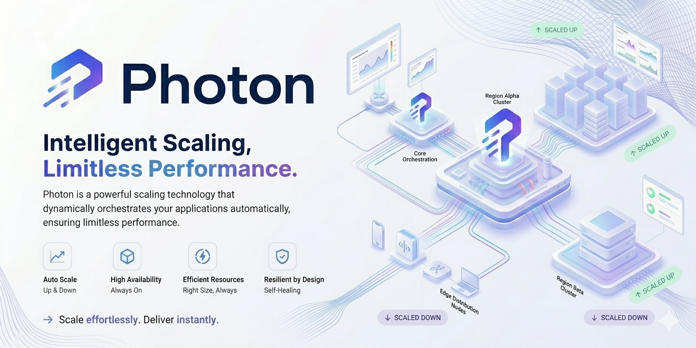

# Photon
Photon is a high-performance distributed routing and scaling layer designed for modern cloud-native applications.  It intelligently routes, balances, and dispatches workloads across a dynamic mesh of nodes, enabling systems to scale seamlessly under heavy traffic while maintaining low latency and high availability.

## License

This project is open source and available under the [MIT License](LICENSE).

---

## Star History

<a href="https://www.star-history.com/?repos=mensi-commits%2FPhoton&type=date&legend=top-left">
 <picture>
   <source media="(prefers-color-scheme: dark)" srcset="https://api.star-history.com/chart?repos=mensi-commits/Photon&type=date&theme=dark&legend=top-left" />
   <source media="(prefers-color-scheme: light)" srcset="https://api.star-history.com/chart?repos=mensi-commits/Photon&type=date&legend=top-left" />
   
 </picture>
</a>

---

Built with &hearts; by [mensi](https://mensi-commits.github.io/)!
